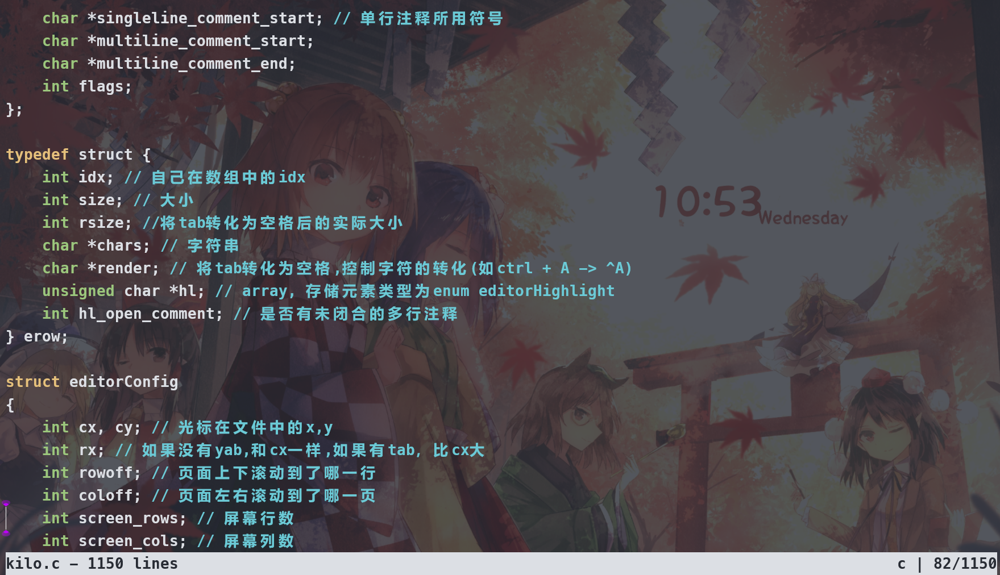
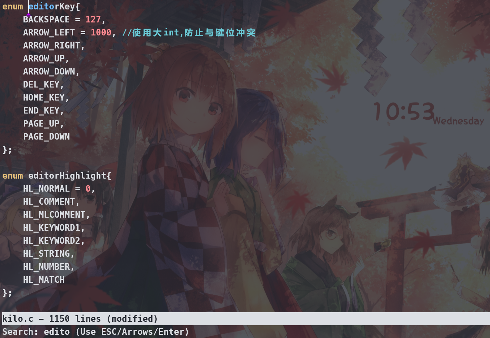

# C语言实现的简易Linux文本编辑器

一个基于C语言开发的简易命令行文本编辑器，支持基本的文本编辑、语法高亮、屏幕适配等功能，适合学习终端编程和文本处理的基础原理。

## 项目环境
- Ubuntu 24.04.3
- GCC 13.3.0

## 编译运行

```bash
# 直接编译
gcc kilo.c -o kilo -Wall -Wextra -pedantic -std=c99
# 或使用make
make

# 运行（直接启动编辑器）
./kilo

# 运行（打开指定文件）
./kilo filename.txt
```

## 效果展示

- 使用`kilo`编辑器打开`kilo.c`:
<div align="center">
    
</div>

- Ctrl-F 搜索功能:
<div align="center">
    
</div>
</div>

## 使用说明

### 基本操作
- **保存文件**：`Ctrl + S`
- **退出编辑器**：连续按 `Ctrl + Q` 三次
- **搜索**: 按下`Ctrl + F`后输入搜索内容, 通过上下箭头匹配上/下一个结果，按`Enter`或`ESC`退出搜索模式
- **光标移动**：方向键（↑↓←→）
- **删除字符**：Backspace（删除光标前字符）、Delete（删除光标后字符）
- **行首/行尾**：`Home` 键 / `End` 键
- **翻页**：`Page Up` / `Page Down`

### 语法高亮支持
目前已支持C语言一部分的语法高亮，包括：
- 关键字高亮（if/else/while等）
- 数据类型高亮（int/long/char等）
- 字符串高亮
- 数字高亮
- 注释高亮（单行//和多行/* */）

## 功能特点
- 原始模式（Raw Mode）终端控制，实现无缓冲输入
- 动态适应终端窗口大小变化
- 光标位置实时追踪与更新
- 文本修改状态标记（未保存时会提示）
- 状态信息显示（底部状态栏显示文件名、修改状态等）

## Reference

- [kilo tutorial](https://viewsourcecode.org/snaptoken/kilo/index.html)
- [kilo-tutorial GitHub](https://github.com/snaptoken/kilo-tutorial)